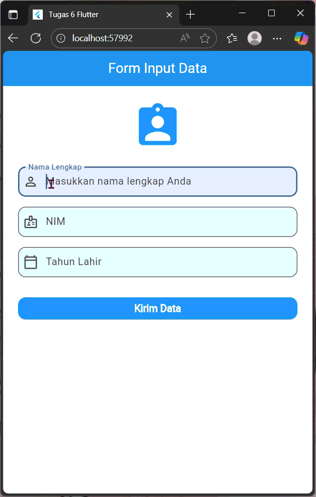

# h1d023020_tugas6

# Penjelasan Proyek Tugas 6 - Passing Data

Proyek ini adalah aplikasi Flutter sederhana yang mendemonstrasikan alur pengiriman (passing) data dari satu halaman (Form Input) ke halaman lain (Tampilan Data).

## Alur Proses Passing Data

Proses pengiriman data dari `form_data.dart` ke `tampil_data.dart` terjadi dalam 3 langkah utama:

### 1. Pengumpulan Data (di `form_data.dart`)

* Data dari pengguna ditampung menggunakan `TextFormField`.
* Setiap `TextFormField` dihubungkan dengan sebuah `TextEditingController` (misalnya `_namaController`, `_nimController`).
* Controller ini "memegang" teks yang diketik oleh pengguna.

### 2. Pengiriman Data (di `form_data.dart`)

* Ketika tombol "Kirim Data" (`ElevatedButton`) ditekan, fungsi `_kirimData()` dipanggil.
* Di dalam `_kirimData()`, kita menggunakan `Navigator.push()`. Perintah ini berfungsi untuk "mendorong" atau membuka halaman baru di atas halaman saat ini.
* Saat memanggil halaman baru (`TampilData`), kita memasukkan data yang sudah diambil dari controller (`_namaController.text`, `_nimController.text`, dll.) ke dalam **constructor** dari widget `TampilData`.

### 3. Penerimaan Data (di `tampil_data.dart`)

* Widget `TampilData` (sebuah `StatelessWidget`) disiapkan untuk **menerima** data.
* Kita mendeklarasikan variabel `final` di dalam kelas `TampilData` untuk setiap data yang akan diterima (misalnya `final String nama;`).
* Kita membuat **constructor** untuk kelas `TampilData` yang mewajibkan (`required`) data-data tersebut diisi saat kelas ini dipanggil.

```dart
// Snippet dari lib/ui/form_data.dart

void _kirimData() {
  // ... (validasi form)

  // Data diambil dari controller
  String nama = _namaController.text;
  String nim = _nimController.text;
  String tahunLahir = _tahunLahirController.text;

  // Data DIKIRIM via constructor TampilData
  Navigator.push(
    context,
    MaterialPageRoute(
      builder: (context) => TampilData(
        nama: nama,
        nim: nim,
        tahunLahir: tahunLahir,
      ),
    ),
  );
}

```
## 📱 Demo Aplikasi



### Tangkapan Layar
|  |  |

